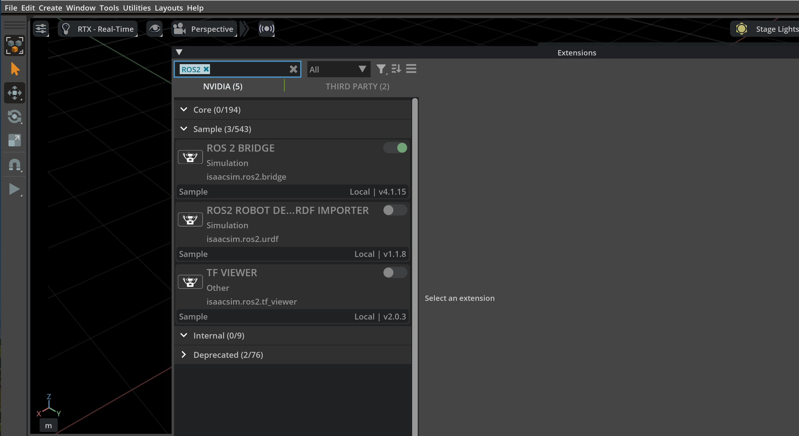
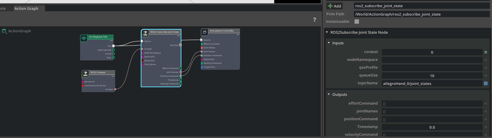
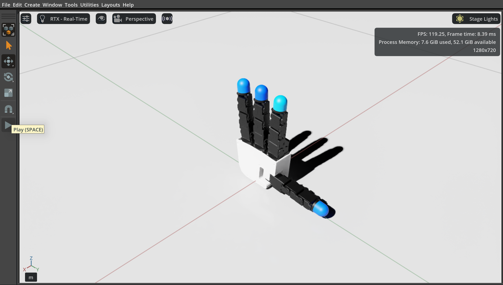
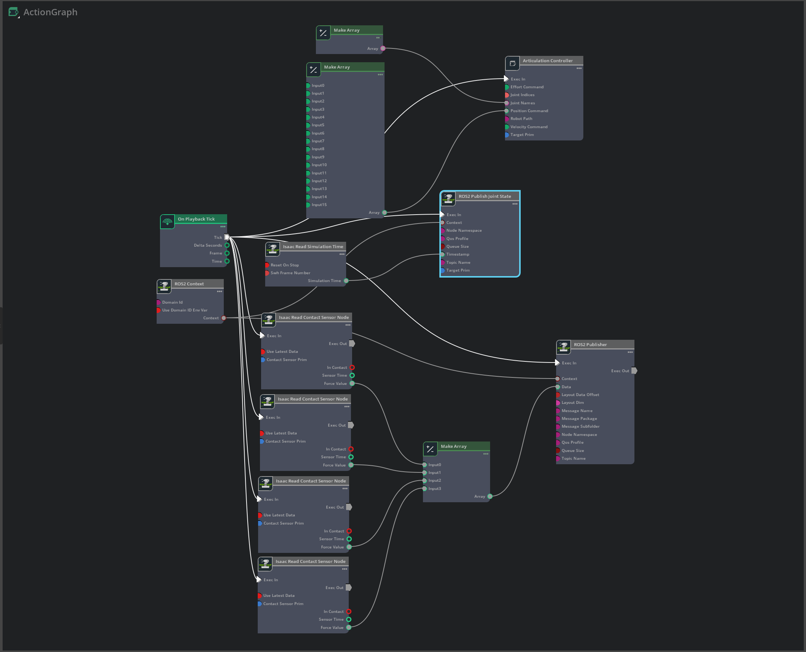
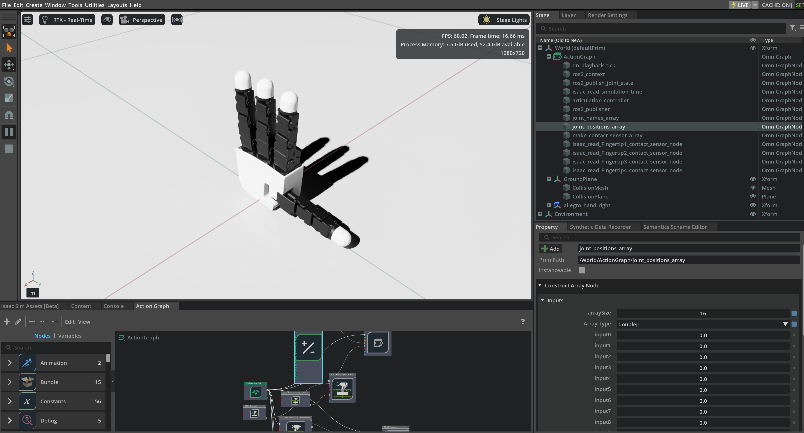

# allegro_hand_isaacsim_package


# Setup

## REAL2SIM

|**Instruction**|**Figure**|
|----------------------------------------------|----------------------|
| 1. Launch Isaac Sim & Check Extenstions(ROS2 Bridge)   |  | 
| 2. Open AH_V5(4F)_REAL2SIM.usd file & Select ‘Yes’ on the warning message. |  | 
| 3. Check Action Graph : <br> - ROS Subscriber topic : allegroHand_0/joint_states <br> - Articulation Controller target prim : /World/allegro_hand_right |  |
| 4. Launch Allegro Hand V5 controller node |``` ros2 launch allegro_hand_controllers allegro_hand.launch.py HAND:=right TYPE:=B``` |
| 5. Press Play Button &nbsp;&nbsp;&nbsp;&nbsp;&nbsp;&nbsp;&nbsp;&nbsp;&nbsp;&nbsp;&nbsp; &nbsp; &nbsp; &nbsp; &nbsp;|  |


## SIM2REAL

|**Instruction**|**Figure**|
|------------------------|----------------------|
| 1. Launch Isaac Sim & Check Extenstions(ROS2 Bridge)  |  | 
| 2. Open AH_V5(4F)_SIM2REAL.usd file|  | 
| 3. Check Action Graph : <br> - **ROS Publisher(Joint states)** <br> topic name : allegroHand_sim/joint_states <br> - **ROS Publisher(Contact sensor)** <br> topic name : allegroHand_sim/contact_sensors <br> - **Articulation Controller** <br> target prim : /World/allegro_hand_right/root_joint |  |
| 4. Launch Allegro Hand V5 controller node with Isaac arguments  | ``` ros2 launch allegro_hand_controllers allegro_hand.launch.py HAND:=right TYPE:=B ISAAC:=true ```|
| 5. Press Play Button & Control the hand joint changing joint_positions_array of ActionGraph |  |


